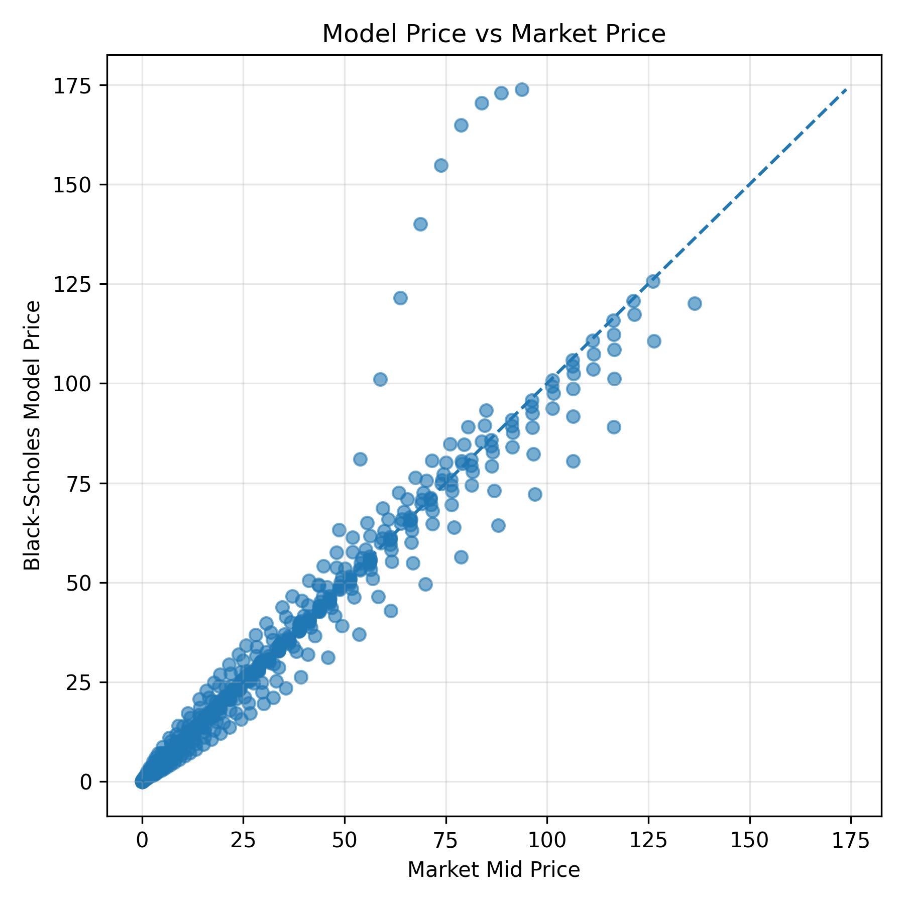
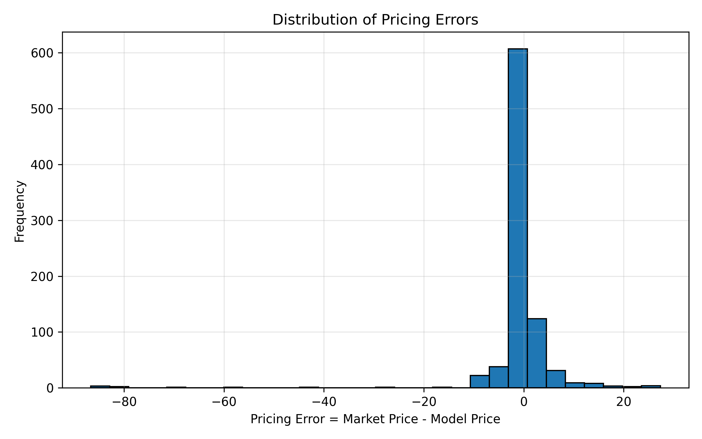
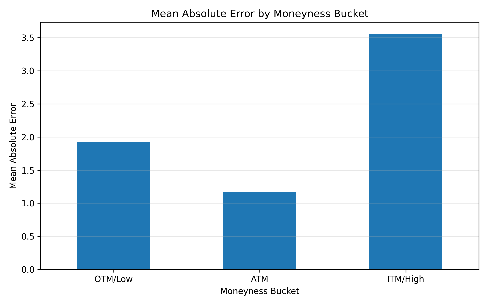
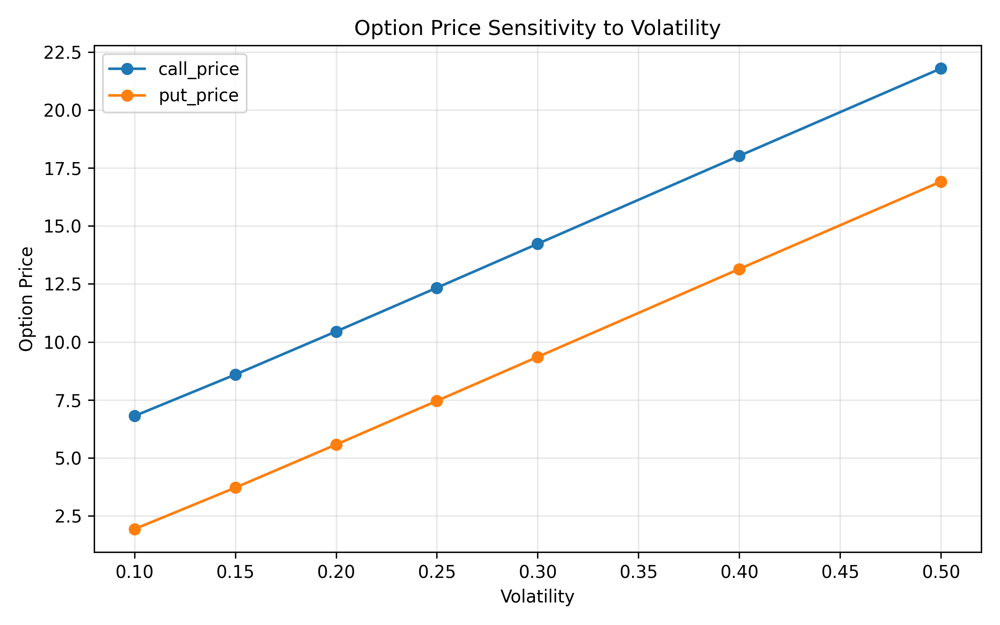
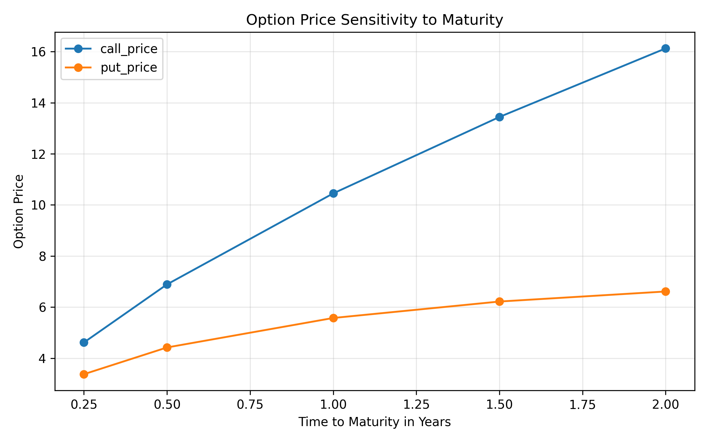
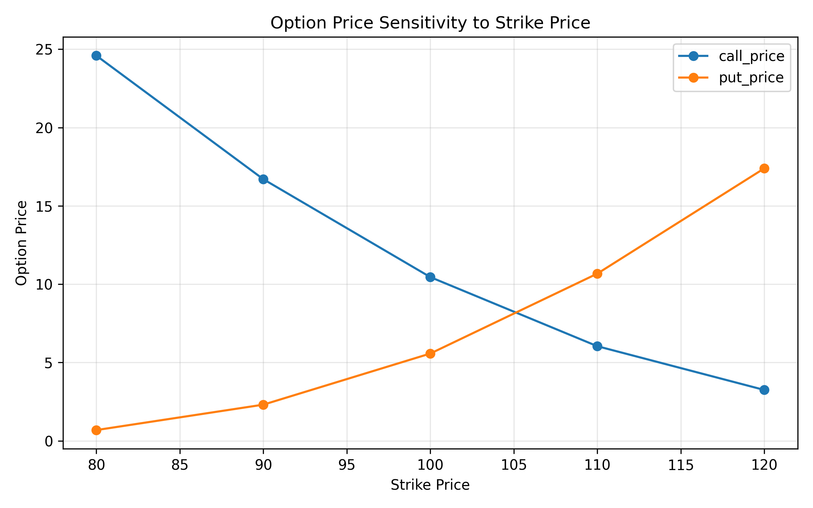

# Black-Scholes Option Pricing Model Validation

This project validates the Black-Scholes option pricing model using both controlled sample data and real Goldman Sachs option market data. It evaluates whether theoretical Black-Scholes prices are consistent with observed market prices, how pricing errors vary across option types and moneyness levels, and how option values respond to changes in key financial assumptions.

---

## What This Project Does

The project performs a complete option pricing and validation workflow:

- Prices European call and put options using the Black-Scholes model.
- Computes option Greeks including Delta, Gamma, Vega, Theta, and Rho.
- Checks put-call parity to verify internal mathematical consistency.
- Compares theoretical model prices with market midpoint prices.
- Quantifies pricing error using MAE, RMSE, MAPE, average pricing error, and maximum absolute error.
- Analyzes pricing errors by option type: call and put.
- Analyzes pricing errors by moneyness bucket: OTM/Low, ATM, and ITM/High.
- Performs sensitivity analysis across volatility, maturity, and strike price.
- Generates CSV reports and visual plots for model interpretation.

---

## How the Project Works

The project uses the Black-Scholes model to calculate theoretical prices for European options. For real-market validation, the Goldman Sachs option dataset provides option quotes, strikes, maturities, implied volatility, and bid-ask prices.

For each option contract, the project extracts the following values:

| Variable | Meaning |
|---|---|
| `S` | Current underlying stock price |
| `K` | Strike price |
| `T` | Time to maturity in years |
| `r` | Risk-free interest rate assumption |
| `sigma` | Implied volatility |
| `option_type` | Call or put |
| `market_price` | Market midpoint price |

The market midpoint price is calculated as:

```text
Market Price = (Bid + Ask) / 2
```

The pricing error is calculated as:

```text
Pricing Error = Market Price - Black-Scholes Model Price
```

This allows the model output to be compared against observed market quotes in a measurable way.

---

## Model Validation Approach

The validation is based on four main checks.

### 1. Pricing Accuracy

The project compares Black-Scholes theoretical prices with market midpoint prices and reports error metrics such as MAE, RMSE, MAPE, average pricing error, and maximum absolute error.

### 2. Put-Call Parity

The project checks whether call and put prices satisfy the European put-call parity relationship:

```text
C - P = S - K exp(-rT)
```

A near-zero parity error indicates that the pricing implementation is internally consistent.

### 3. Segmented Error Analysis

Pricing errors are grouped by:

- option type: call vs put
- moneyness bucket: OTM/Low, ATM, ITM/High

Moneyness is calculated as:

```text
Moneyness = S / K
```

This helps identify where the model performs better or worse.

### 4. Sensitivity Analysis

The project studies how option prices change when one input changes while the others remain fixed. It analyzes sensitivity to:

- volatility
- time to maturity
- strike price

This confirms whether the model behaves in an economically reasonable way.

---

## Visual Results

### Model Price vs Market Price

This plot compares Black-Scholes theoretical prices with market midpoint prices. Points close to the diagonal line indicate better agreement between the model and market prices.



---

### Pricing Error Distribution

This plot shows the distribution of pricing errors across the Goldman Sachs option contracts.



---

### Mean Absolute Error by Moneyness Bucket

This plot shows how pricing error changes across moneyness categories.



---

### Volatility Sensitivity

This plot shows how call and put option prices respond to changes in volatility.



---

### Maturity Sensitivity

This plot shows how call and put option prices respond to changes in time to maturity.



---

### Strike Sensitivity

This plot shows how call and put option prices respond to changes in strike price.



---

## Generated Outputs

The project generates the following result files:

```text
reports/pricing_error_results.csv
reports/gs_pricing_error_results.csv
reports/gs_error_by_option_type.csv
reports/gs_error_by_moneyness.csv
reports/volatility_sensitivity.csv
reports/maturity_sensitivity.csv
reports/strike_sensitivity.csv
reports/model_validation_report.md
```

It also generates the following plots:

```text
reports/plots/model_vs_market_price.png
reports/plots/pricing_error_distribution.png
reports/plots/mae_by_moneyness_bucket.png
reports/plots/volatility_sensitivity.png
reports/plots/maturity_sensitivity.png
reports/plots/strike_sensitivity.png
```

---

## Key Metrics Reported

| Metric | Meaning |
|---|---|
| MAE | Average absolute difference between market price and model price |
| RMSE | Square-root of average squared pricing error |
| MAPE | Average percentage pricing error |
| Average Pricing Error | Average signed difference between market price and model price |
| Max Absolute Error | Largest observed absolute pricing error |

---

## Model Assumptions

The Black-Scholes model used in this project assumes:

- European-style exercise
- no dividends
- constant volatility
- constant risk-free interest rate
- no transaction costs
- no bid-ask spread in the theoretical model
- continuous trading and hedging
- lognormal underlying stock price dynamics

---

## Important Validation Note

The real-data analysis uses implied volatility from the dataset as the volatility input. Since implied volatility is derived from market option prices, the comparison between Black-Scholes model prices and market midpoint prices is mainly a model implementation and consistency validation exercise.

A stronger extension would be to estimate historical volatility from Goldman Sachs stock returns and compare those prices against market option prices.

---

## Limitations

The current version has the following limitations:

- Dividend yield is not included.
- The risk-free rate is fixed as a simplifying assumption.
- Volatility is treated as constant for each option contract.
- American-style early exercise is not modeled.
- Market liquidity and transaction costs are not modeled.
- Bid-ask spread effects are simplified using midpoint price.
- Implied volatility is used as an input, so real-data pricing errors may be smaller than in an independent forecasting setup.

---

## Future Improvements

Possible extensions include:

- Add dividend yield support.
- Estimate historical volatility from underlying stock returns.
- Add an implied volatility solver.
- Compare historical-volatility pricing with implied-volatility pricing.
- Use a maturity-matched risk-free yield curve.
- Add Monte Carlo option pricing.
- Add volatility smile and volatility surface analysis.
- Build a Streamlit dashboard for interactive visualization.

---

## Skills Demonstrated

```text
Python
NumPy
SciPy
Pandas
Matplotlib
Options pricing
Greeks computation
Derivatives analytics
Model validation
Pricing error analysis
Sensitivity analysis
Quantitative finance
```

---

## Resume Summary

Built a Python-based Black-Scholes model validation framework for Goldman Sachs options, computing European call and put prices, Greeks, put-call parity error, sensitivity analysis, and real-market pricing deviations using MAE, RMSE, MAPE, option-type segmentation, and moneyness-based error analysis.